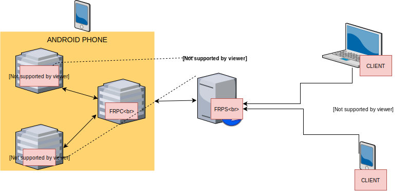

## This software needs [Termux](https://www.termux.com)
## Install git and clone repository.
```
pkg upgrade
pkg install git
git clone --recurse-submodules https://github.com/s4l1h/androidproxy
```

**After cloning repository You need to modify variables for your server.**

## Changing proxy server user and password 
(default username & password are **akm** and local proxy port **3120**)

[proxy/main.go](https://github.com/s4l1h/androidproxy/blob/master/proxy/main.go#L15)

## Changing frpc config ( you must change!)
(default remote proxy port **7499** and ssh port **7498**)

[proxy/frpc.ini](https://github.com/s4l1h/androidproxy/blob/master/frpc.ini#L2,L4)


**for more details please look at [frp docs](https://github.com/fatedier/frp).**

### After configurations are done. 

You can install it.
```
sh install.sh
```
And finaly starting services
```
sh start.sh
```

 ### If you want the services to run at startup.
  1) Create [Termux Boot](https://github.com/termux/termux-boot) symlinks.
```
sh termux-boot.sh
```
 2) You can use **.bashrc** instead of Termux Boot. You just need to put [start.sh](https://github.com/s4l1h/androidproxy/blob/master/start.sh) to your .bashrc file. It is a kind of monkey fix. It will be a problem if you connect via ssh.
```
echo $HOME/androidproxy/start.sh >> $HOME/.bashrc
```


